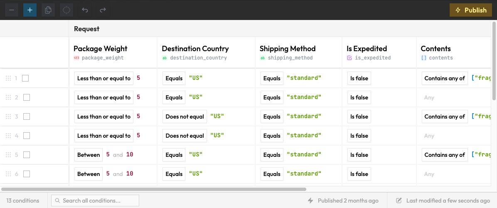
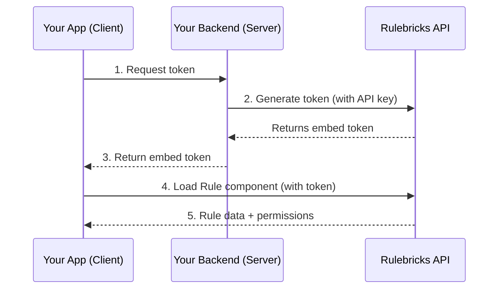

## Rulebricks Embedded


<div align="start">
  <p>
    <a href="https://rulebricks.com">Website</a> •
    <a href="https://rulebricks.com/docs/embedding-rulebricks/about-embedded">Embedded Documentation</a> • 
    <a href="https://github.com/rulebricks/node-sdk">Node SDK</a> •
    <a href="mailto:support@rulebricks.com">Support</a>
  </p>
</div>

Embed the Rulebricks decision table UI directly in your application, and get access to enterprise-grade business rule configuration, management, and execution capabilities in minutes.



Set up your schemas/tenants on Rulebricks, and in just a few lines of code, our embeddable decision table editor helps you build and orchestrate:

- **Customer portals** – Let customers configure their own business rules
- **Partner integrations** – Provide rule editing to external partners
- **Internal tools** – Embed rule management in admin dashboards

Also see our [Node SDK](https://github.com/rulebricks/node-sdk) for management functionality.


---

### Installation

```bash
npm install @rulebricks/embedded
```

### Quick Start

#### 1. Generate a token (server-side)

Using the helper function:

```javascript
import { createEmbedToken } from "@rulebricks/embedded/server";

const { token } = await createEmbedToken({
  apiKey: process.env.RULEBRICKS_API_KEY,
  // Get this from your dashboard URL, or published URL slug
  ruleId: "your-rule-id",
  baseUrl: "https://rulebricks.com", // or your private instance
});
```

Or call the API directly:

```javascript
const response = await fetch("https://rulebricks.com/api/embed/token", {
  method: "POST",
  headers: {
    "Content-Type": "application/json",
    "x-api-key": process.env.RULEBRICKS_API_KEY,
  },
  body: JSON.stringify({
    ruleId: "your-rule-id",
    expiresIn: 3600, // seconds
  }),
});

const { token } = await response.json();
```

#### 2. Render the component (client-side)

```jsx
import { Rule } from "@rulebricks/embedded";

function App() {
  return (
    <Rule
      embedToken={token}
      height={600}
      onPublish={(e) => console.log("Published:", e.rule)}
      onError={(e) => console.error(e)}
    />
  );
}
```

### Props

It is important to note that most UI customization still needs to be done in the Rulebricks dashboard, particularly management around organization branding, user tenancy, and roles.

Your embeds will always inherit these settings, and users will only be able to work with rules that they have permission to view/edit, and in ways their role allows.

| Prop              | Type       | Default                  | Description                   |
| ----------------- | ---------- | ------------------------ | ----------------------------- |
| `embedToken`      | `string`   | required                 | Token from your backend       |
| `apiBaseUrl`      | `string`   | `window.location.origin` | Rulebricks instance URL       |
| `height`          | `number`   | `600`                    | Container height in pixels    |
| `showFooter`      | `boolean`  | `true`                   | Show bottom status bar        |
| `showControls`    | `boolean`  | `true`                   | Show top navbar               |
| `showRowSettings` | `boolean`  | `false`                  | Show row settings gear icon   |
| `onPublish`       | `function` | –                        | Called when rule is published |
| `onError`         | `function` | –                        | Called on errors              |

### How It Works



### License

Elastic License 2.0
